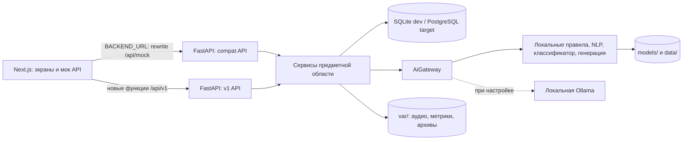

# Архитектура Responders Academy

Состояние кода: 2026-09-29. Это учебный стенд с синтетическими данными; он не подключён к боевой системе 112. Источник требований — `specs/002-two-mode-simulator/`, фактическое поведение определяется кодом `backend/app/` и `backend/ml/`.

## Функциональная схема

1. Преподаватель выбирает карточки или создаёт сценарии, назначает занятие и обучаемых. Для AI-сценариев есть черновик, правка, утверждение и версии.
2. Обучаемый отрабатывает карточку в режиме ДДС или специалиста 112: заполняет поля, меняет статусы, выполняет звонки и завершает попытку. Лента занятия опрашивается по HTTP.
3. Локальный оценщик строит компоненты, ошибки с `ruleId` и итоговую оценку. Преподаватель может переопределить результат; правка сохраняется для аудита и последующей калибровки.
4. Преподаватель получает индивидуальный и групповой отчёт, экспорт CSV/PDF, историю ошибок. Администратор управляет пользователями, настройками и ручным резервным копированием.

## Компоненты и поток данных

- `app/main.py` монтирует совместимый роутер `app/api/compat/` под префиксами `API_PREFIXES` (обычно `/api/mock` и `/api/v1`) и новые роутеры `app/api/v1/` только под `/api/v1`. В текущей сборке зарегистрированы AI-оценки, ошибки, AI-сценарии, экспорт, билеты, режим 112, задания, валидация, лобби, рекомендации и рабочие сообщения.
- `app/api/deps.py` извлекает подписанный JWT из cookie `arm112_session` или Bearer, проверяет серверную запись сессии, активность пользователя и роль. Сервисы дополнительно ограничивают доступ по владельцу попытки, преподавателю занятия и назначенной версии сценария.
- `app/services/` хранит правила жизненного цикла занятия, прав доступа, отчётов и аудита. SQLAlchemy-модели в `app/models/` работают с SQLite для разработки и PostgreSQL для целевого стенда; миграции Alembic находятся в `backend/alembic/`.
- `app/ai_gateway.py` отделяет API от `ml/`: оценка по правилам, классификатор ЕКП, SymSpell/эмбеддер, проверка билетов, шаблонная генерация, TTS/STT. Модели подготавливаются явно через `ml.scripts.prepare_models`; при недоступности опционального компонента используется предусмотренный фолбэк или возвращается ошибка конкретной функции. Вызовов внешних API в штатном рантайме нет.
- Новый контур `app/api/v1/ai_*` ведёт версии оценок, реестр ошибок, разрешение спорных смысловых случаев и версии сценариев. `ml/dataset/`, `ml/pipeline/`, `ml/prompts/` и `ml/release.py` готовят примеры и правила допуска локального модельного релиза; подготовка датасета и ревью не выполняются при обычном HTTP-запросе.
- `var/` содержит изменяемые файлы и исключён из Git. `GET /api/v1/health` сообщает о наличии и загрузке моделей; `GET /api/v1/metrics/ml` читает локальный `var/metrics.json`.

## Матрица доступа

Здесь «свой» означает владельца попытки, назначенного обучаемого или преподавателя конкретного занятия. Это матрица **ожидаемой границы**; фактические ограничения указаны в последнем столбце.

| Ресурс / операция | Обучаемый | Преподаватель | Администратор | Текущее состояние |
|---|---|---|---|---|
| Своя попытка и оценка | Чтение/выполнение | Чтение своего занятия | Чтение | Для AI-маршрутов проверяются владелец и занятие; совместимые маршруты проверяют область видимости в сервисах. |
| Чужая попытка и отчёт | Нет | Только своё занятие | Чтение | Фильтрация обучаемого по `studentId`; экспорт повторно проверяет доступ. |
| Занятие: лента | Назначенный участник | Своё занятие | Чтение | В `session_engine`; окно событий `(since, at]`. |
| Занятие: управление | Нет | Своё занятие | Управление | `control` ограничен для авторизованных ролей, но анонимный вызов совместимого маршрута пока пропускается. |
| Сценарии и версии AI | Назначенная утверждённая версия | Свои черновики/версии, утверждение | Полный доступ | `ai_access.py` проверяет владение и точную версию; совместимые маршруты имеют отдельные правила. |
| Назначения/экзамены | Свои | Создание и свои занятия | Управление | Проверки в `assignment_service.py`. |
| Справочники, карточки банка | Чтение | Чтение | Чтение | Часть совместимых GET доступна анонимно для совместимости с мок API. |
| Пользователи, системные настройки | Нет | Нет | Управление | Проверка администратора в `admin_users.py` и `admin_system.py`. |
| Сырые ML-метрики | Не разграничено | Не разграничено | Не разграничено | `/api/v1/metrics/ml` сейчас без авторизации; ограничение следует добавить при T114. |

Перед промышленным применением требуется завершить T114: проверить всю матрицу контрактными тестами, закрыть анонимные операции управления и системные метрики. Таблица не заявляет уже достигнутую полную изоляцию.

## Путь внедрения инфраструктуры (принцип IV)

| Этап | Сейчас | Следующее решение и условие включения |
|---|---|---|
| TLS | Локальный HTTP в изолированном стенде | Для доступа по сети поставить reverse proxy с сертификатом, HTTPS и защищёнными cookie; проверить доверие клиентов и запрет прямого доступа к API. |
| SIP/телефония | Звонки и реплики эмулируются, аудио билетов создаётся локально; Vosk может распознавать загруженный WAV | Только после согласования контура интеграции: отдельный адаптер SIP, синтетический тестовый номер, журнал согласий и изоляция от боевой сети. Текущие сервисы не открывают SIP-соединение. |
| Бэкапы по расписанию | `services/backup.py`: ручной SQLite backup или `pg_dump` в `var/backups/`; ошибка попадает в системный журнал | Внешний планировщик, отдельное хранилище, шифрование, срок хранения и регулярная проверка восстановления; не считать сам факт файла успешным восстановлением. |
| БД | SQLite для локальной разработки; PostgreSQL 14 — целевой | Прогон миграции и сидов на реальном PostgreSQL 14 остаётся открытой частью T109. |

После каждого этапа заново проверяются офлайн-режим, матрица доступа, восстановление из архива и производительность. TLS, SIP и планировщик здесь описаны как маршрут внедрения, они ещё не реализованы.
