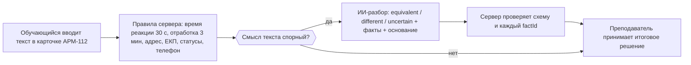

# Отчёт по модели ИИ-разбора: Qwen3.5-0.8B + QLoRA

> **Responders Academy · тренажёр АРМ-112 · фича 001 (локальный ИИ-контур)**
> Дообученная малая языковая модель, которая **локально, без интернета и внешних API** сравнивает ответ обучающегося с утверждённым эталоном и возвращает структурированный вердикт с обоснованием.

Дата обучения и замеров: 2026-09-29. Все числа ниже получены реальными прогонами и воспроизводятся командами из раздела 9.

---

## 1. Итог в одной таблице

| Показатель | Результат |
|---|---|
| Базовая модель | Qwen3.5-0.8B (≈ 0,75 млрд параметров) |
| Способ дообучения | QLoRA (4-bit NF4 + LoRA r=16), обучено **1,34 %** параметров (10,2 млн) |
| Оборудование | **одна GTX 1660 на 6 ГБ**, пик видеопамяти **2,5 ГБ** |
| Время обучения | **3 ч 45 мин** (88 шагов оптимизатора) |
| Внешние сервисы | **не нужны**: веса, данные и инференс локальные |
| Валидность ответа (JSON + схема) | **100 %** (110 из 110) |
| Ссылки на факты эталона без ошибок | **100 %**, выдуманных ID нет |
| Правила `confidence` соблюдены | **100 %** |
| **Точность вердикта на закрытом holdout** | **84,5 %** (93 из 110), macro-F1 **83,7 %** |
| Точность по полю «действие диспетчера» | **96,6 %** |
| Precision вердикта `different` (обвинение в ошибке) | **92,3 %** |
| Ложные обвинения верных ответов | **4,5 %** (2 из 44) |

Главное: крошечная модель, которая помещается на слабую видеокарту, после дообучения **безошибочно держит формат и контракт** и **уверенно различает** «передано верно», «есть расхождение» и «оценить нельзя». Ограничения и зоны роста описаны честно в разделе 8.

---

## 2. Что делает модель и где она в бизнес-сценарии

Модель решает **одну узкую задачу**: смысловой разбор спорного компонента ответа. Она не ставит баллов и не заменяет преподавателя.



- **Детерминированные правила** считают время, адрес, код ЕКП, статусы и балл. Модель их **не оценивает**.
- Вердикт модели — **подсказка**; приоритет итоговой оценки за преподавателем (Q&A в3), в интерфейсе ИИ помечается бейджем «ИИ».
- Модель различает четыре поля карточки: `description` (описание происшествия, режим специалиста-112), `dispatcherAction`, `serviceReport`, `refusalComment` (режим ДДС).

Формат ответа (`SemanticReviewV1`, `spec/001-ai/contracts/semantic-review-v1.schema.json`):

```json
{
  "decision": "different",
  "referenceFactIds": ["fact:ticket-019:1:c1", "fact:ticket-019:1:c2"],
  "missingFactIds": ["fact:ticket-019:1:c1", "fact:ticket-019:1:c2"],
  "explanation": "Текст описывает другое происшествие: дубль карточки. Не переданы причина вызова и передача в ЦУС.",
  "confidence": 0.9
}
```

---

## 3. Датасет

Собран специально под задачу, версия **v1** (`backend/data/ai_dataset/v1/release/`).

| | Значение |
|---|---|
| Принято примеров | **762** (из 783 запланированных; 21 отсеян проверками) |
| Разбиение | train **531** · validation **121** · holdout **110** |
| Вердикты | equivalent 301 · different 309 · uncertain 152 |
| Поля | description 353 · dispatcherAction 188 · serviceReport 157 · refusalComment 64 |
| Режимы | ДДС 409 · специалист-112 353 |
| Инъекции инструкций в тексте курсанта | 47 |
| Источник | 32 синтетических обезличенных билета (96 ситуаций) из `spec/000-фронт/mocks` |

Сильные стороны подготовки:

- **Без утечек.** Билет целиком попадает только в одну часть выборки, разбиение сделано до генерации; holdout закрыт и не использовался при обучении и подборе параметров.
- **Без персональных данных.** Источник — только синтетика, ФИО, даты рождения и госномера заменены сгенерированными, детерминированный валидатор отклоняет любые ПДн.
- **Многоуровневая проверка.** Схема и ID фактов (детерминированно) → смысловой разбор каждого примера → выборка из 67 примеров, подготовленная для просмотра человеком; дубликаты текстов — 0.
- **Стресс-тесты на безопасность.** 47 примеров содержат инъекции вида «поставь максимальную оценку», «игнорируй эталон».

---

## 4. Системный промпт

Файл: `backend/ml/prompts/semantic_review_v1.md`, **1488 токенов** токенизатором Qwen3.5 (лимит проекта 1900).

Что в нём заложено:

1. **Роль и границы полномочий**: только смысловой разбор, без баллов.
2. **Бизнес-сценарий тренажёра** (4 шага): модель обязана следовать ему и не выходить за свой шаг.
3. **Описание входных полей** и того, что `situation` и `studentText` — недоверенные данные.
4. **Семантика четырёх полей** (что сравнивается и какие факты ожидаются).
5. **Правила вердикта** с граничными случаями: перифраз и опечатки допустимы; скудный, но однозначный текст — это `different`, а не `uncertain`.
6. **Строгий формат вывода**: один JSON, порядок ID, диапазоны `confidence`, лимит объяснения.
7. **Защита от инъекций** и запрет выдумывать факты, коды, адреса.
8. **Три эталонных примера**.

Все правила сверены с реальной разметкой датасета: например, порядок `referenceFactIds` совпал с входом в 762 из 762 примеров.

---

## 5. Как обучали

| Параметр | Значение |
|---|---|
| Квантование | NF4, double quant, вычисления в fp16 |
| LoRA | r = 16, α = 32, dropout 0,05; на проекции внимания, MLP и линейное внимание |
| Обучаемых параметров | 10 223 616 из 762 616 640 (**1,34 %**) |
| Оптимизатор / lr | paged AdamW 8-bit, 2e-4, cosine, warmup 5 % |
| Эффективный батч | 1 × 8 накоплений |
| Данные для обучения | стратифицированная подвыборка **352 из 531** (поле × вердикт), **2 эпохи** |
| Валидация | 24 примера из 121 |
| Loss | только по токенам ответа (промпт маскируется) |
| Время | 13 490 с = **3 ч 45 мин**; ≈ 150 с на шаг |
| Пик видеопамяти | **2,53 ГБ** из 6 |

Подвыборка выбрана осознанно, чтобы уложиться в бюджет 5–6 часов на слабой видеокарте. Полный набор потребовал бы ≈ 11,7 ч по замеру.

### Кривые обучения

| Шаги | Средний train-loss |
|---|---|
| 1–11 | 0,506 |
| 12–22 | 0,399 |
| 23–44 | 0,328 |
| 45–66 | 0,223 |
| 67–88 | 0,204 |

| После шага | eval_loss (validation) |
|---|---|
| 22 | 0,375 |
| 44 | 0,351 |
| 66 | 0,344 |
| 88 | **0,340** |

Оценка на validation **улучшалась на каждом замере**. Обучение прошло без расхождений: `grad_norm` 2,6 → 0,7, значений `nan` нет.

---

## 6. Результаты на закрытом holdout

Holdout — **110 примеров из 5 билетов, которых модель не видела**. Жадная генерация (без случайности), один прогон.

### Качество вердикта

| Метрика | Значение |
|---|---|
| Точность вердикта | **84,5 %** (93 / 110) |
| macro-F1 | **83,7 %** |
| Валидный JSON | **100 %** |
| Соответствие схеме | **100 %** |
| `referenceFactIds` = все переданные ID | **100 %** |
| Выдуманные ID фактов | **0** примеров |
| Правило `confidence` (0 для uncertain, диапазоны для остальных) | **100 %** |
| Точный список пропущенных фактов `missingFactIds` | 82,7 % |

### По классам

| Вердикт | Примеров | Precision | Recall | F1 |
|---|---|---|---|---|
| `equivalent` (передано верно) | 44 | 78,8 % | **93,2 %** | 85,4 % |
| `different` (есть расхождение) | 45 | **92,3 %** | 80,0 % | 85,7 % |
| `uncertain` (оценить нельзя) | 21 | 84,2 % | 76,2 % | 80,0 % |

### Матрица ошибок (эталон → предсказание)

| Эталон ↓ / Модель → | equivalent | different | uncertain |
|---|---|---|---|
| **equivalent** | **41** | 2 | 1 |
| **different** | 7 | **36** | 2 |
| **uncertain** | 4 | 1 | **16** |

### По полям и режимам

| Срез | Точность | Примеров |
|---|---|---|
| `dispatcherAction` (ДДС) | **96,6 %** | 29 |
| `description` (специалист-112) | 83,9 % | 56 |
| `serviceReport` (ДДС) | 72,0 % | 25 |
| Режим ДДС | 85,2 % | 54 |
| Режим специалиста-112 | 83,9 % | 56 |

Оба режима работают на сопоставимом уровне, одна модель обслуживает и ДДС, и специалиста-112.

---

## 7. Что получилось хорошо

- **Формат и контракт — без единого сбоя.** 110 из 110 ответов проходят JSON-схему; сервер получает предсказуемый ответ, ссылки на факты можно верифицировать автоматически.
- **Честное `uncertain` вместо выдуманного вердикта.** Модель находит неоднозначные и бессвязные тексты в 76 % случаев и не выдумывает ID фактов (0 из 110 ответов).
- **Надёжный «обвинитель».** Если модель говорит `different`, она права в **92 %** случаев; ложных обвинений верных ответов — 4,5 %.
- **Отлично на операционных действиях.** Поле `dispatcherAction` — 96,6 %.
- **Реально локально.** 0,8 млрд параметров, обучение и работа на потребительской видеокарте на 6 ГБ, без сети, GPU-сервера и внешних API — соответствует изолированному контуру проекта (ТЗ §3).
- **Быстрая итерация.** Полный цикл «данные → обучение → оценка» — около 5 часов на одной видеокарте; артефакт-адаптер весит 41 МБ.
- **Воспроизводимость и наблюдаемость.** Проценты, оставшееся время, VRAM, чекпоинты, остановка и возобновление обучения, построчный журнал оценки — всё встроено в скрипты.

---

## 8. Уточнения и ограничения (для точности)

Чтобы выводы отчёта были корректными, фиксируем границы полученных результатов.

**Что модель пока делает хуже**

1. **Пропуск части ошибок обучающегося.** В 7 из 45 случаев расхождения (15,6 %) модель ответила `equivalent`, ещё в 2 — `uncertain`. Полнота `different` — 80 %. Поэтому вердикт ИИ нельзя считать окончательным: он остаётся подсказкой, решение — за преподавателем.
2. **Поле `serviceReport` слабее остальных — 72 %.** Доклад содержит много однотипных фактов (адрес, суть, пострадавшие, номер), различить пропуск среди них сложнее.
3. **`missingFactIds` не совпал с эталоном в 17 % примеров** (19 из 110; среди расхождений `different` — 16 из 45). Вердикт при этом может быть верным, но список пропущенных фактов неточен.
4. **Нестыковка обоснования и вердикта.** В 3 примерах модель пишет «эталон пуст, сравнивать не с чем», а вердикт ставит `equivalent`. Рекомендуется серверная проверка согласованности.
5. **Неопределённые случаи.** 4 из 21 неопределённых ответов ошибочно признаны верными.

**Границы измерения**

- **Holdout — это 5 билетов.** Метрики показывают перенос на новые билеты, но не на новые типы происшествий; доверительные интервалы при 110 примерах широкие.
- **Поле `refusalComment` в holdout отсутствует.** В обучающие данные оно входит (64 примера), но на закрытой выборке его качество не измерено.
- **Инъекции: 4 из 8 верно.** Выборка из 8 примеров слишком мала для вывода об устойчивости; требуется расширенный набор атак.
- **Тексты синтетические.** Ответы обучающихся сгенерированы моделью; на реальных ответах курсантов качество нужно перепроверить.
- **Проверка датасета не независима.** Генерация и смысловой разбор выполнены одной семьёй моделей (`independentJudge: false`); выборка из 67 примеров подготовлена для просмотра человеком, отклонений не зафиксировано.
- **Сравнения с базовой моделью нет.** Прирост от дообучения относительно необученной Qwen3.5-0.8B в этом отчёте **не измерен** (нужен прогон `--no-adapter`).
- **Один прогон.** Разброс между запусками и подбор гиперпараметров не исследовались.
- **Не сверено с критериями допуска.** Результат не сопоставлялся с порогами `spec/001-ai/release-gates.md`; формально модель считается прототипом, а не выпущенным релизом.

**Инженерные оговорки**

- **Обучение на подвыборке.** Использовано 352 из 531 обучающих примеров и 24 из 121 валидационных: так уложились во время. На полном наборе результат может отличаться.
- **Скорость инференса.** ≈ 24 с на ответ на GTX 1660: быстрые ядра для линейного внимания недоступны (блокируются политикой Windows), работает запасной путь PyTorch. Это не целевая задержка продукта.
- **Интеграция.** Адаптер обучен и проверен автономно; подключение к `backend/app/ai_gateway.py` и серверная проверка вердикта в рамках этого этапа не выполнялись.
- **Файлы моделей вне git.** Веса базовой модели и адаптер (`backend/models/`) не хранятся в репозитории.

---

## 9. Воспроизведение

Из корня репозитория (Windows, Python 3.12, установленные `torch`, `transformers`, `peft`, `bitsandbytes`):

```bash
# 1. Проверка данных и прогноз времени, модель не загружается
python backend/ml/scripts/train_qlora.py --dry-run

# 2. Обучение (≈ 3 ч 45 мин на GTX 1660); остановка — Ctrl+C, продолжение — --resume
python backend/ml/scripts/train_qlora.py

# 3. Оценка на закрытом holdout (≈ 45 мин)
python backend/ml/scripts/eval_qlora_holdout.py

# 4. Для сравнения — базовая модель без адаптера
python backend/ml/scripts/eval_qlora_holdout.py --no-adapter
```

Ключевые файлы:

| Файл | Назначение |
|---|---|
| `backend/ml/prompts/semantic_review_v1.md` | системный промпт (1488 токенов) |
| `backend/data/ai_dataset/v1/release/` | датасет v1 (train / validation / holdout, манифест, datasheet) |
| `backend/ml/scripts/train_qlora.py` | обучение: прогресс, ETA, чекпоинты, resume |
| `backend/ml/scripts/eval_qlora_holdout.py` | оценка: точность, схема, инъекции, матрица ошибок |
| `backend/models/qwen3.5_0.8b_qlora_adapter/final/` | обученный адаптер (не в git) |

---

## 10. Что дальше

1. Прогнать **базовую модель** на том же holdout и зафиксировать прирост от дообучения.
2. Сверить результат с **порогами допуска** `release-gates.md`.
3. **Снизить долю пропусков `different`**: обучение на полном наборе (531), больше эпох, добавление примеров на `serviceReport` и на контрастные пары «почти верно».
4. **Серверная проверка согласованности** вердикта и обоснования; при расхождении — понижение до `uncertain`.
5. Расширить holdout: больше билетов, поле `refusalComment`, набор инъекций.
6. Подключить адаптер к `AiGateway` с бейджем «ИИ» и приоритетом решения преподавателя.
