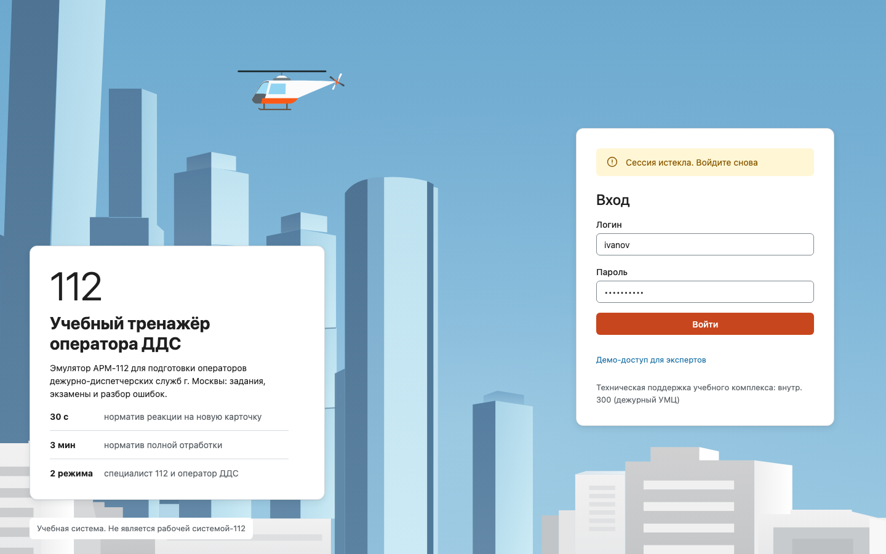
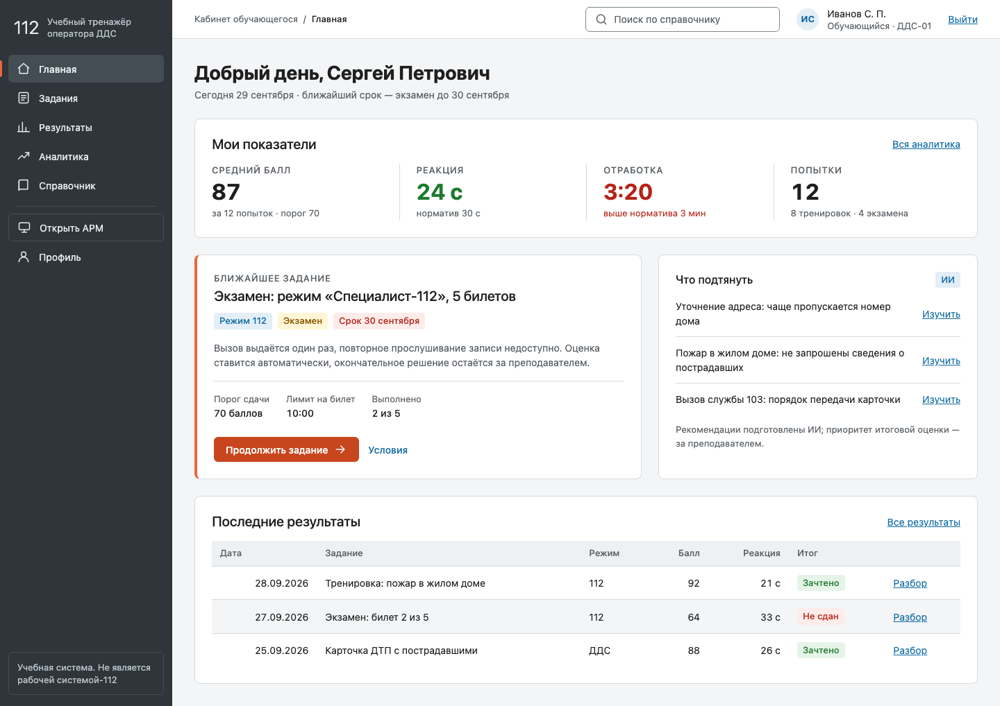
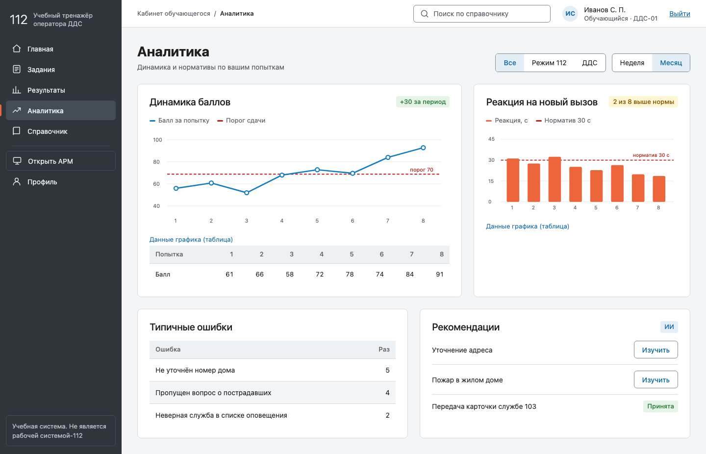

# Платформа-обложка: визуальный язык (T037)

**Статус: ✅ утверждено владельцем 2026-09-29** (запись в разделе «Утверждение владельца» внизу). До этой записи задачи T038–T045, T051 и T054 (`spec/002-full-system-integration/tasks.md`) не начинались (SC-014).

Связано: `spec/002-full-system-integration/07-platform-shell.md` §5 · `research.md` R19 · токены — `src/shared/ui/styles/tokens-platform.css` · замеры контраста — `tokens-platform.test.ts` (Vitest).

## 1. Что утверждается

1. **Граница.** Платформа (вход, кабинеты, справочник, профиль) получает новый визуальный язык; симулятор `/arm/*` остаётся точной репликой АРМ-112 (правило №1, `spec/000-фронт/07-design-guidelines.md`). В симулятор добавляется только тонкая панель «В кабинет» в токенах АРМ. Это поправка к решению владельца от 2026-09-18 (допущение A11).
2. **Родство с АРМ.** Те же графит шапки, оранжевый (главное действие) и синий (навигация), цветокод статусов; но светлые поверхности, карточки, воздух, спокойные таблицы.
3. **Токены `--pf-*`** (раздел 3) и **эскизы** трёх экранов (раздел 4) как ориентир для компонентов T038.
4. **Шрифт** — локальный системный (`system-ui`, затем Segoe UI/Roboto/Arial): без CDN и скачиваемых шрифтов (принцип I «локальный контур»). Роскошь брендового шрифта здесь недоступна сознательно.

## 2. Принципы (почему так)

| Решение | Обоснование |
|---|---|
| Главное действие — **затемнённый** оранжевый `#c8461d`, не `#ec653b` | Белый текст на `#ec653b` — 3,24:1 (не проходит 4,5:1 для обычного текста, WCAG 1.4.3). `#c8461d` — 4,83:1. Исходный оранжевый остаётся для индикаторов и графики (порог 3:1, WCAG 1.4.11) |
| Ссылки и выбор — `#0f6aa3` вместо `#157dbd` | `#157dbd` на белом — 4,47:1 (чуть ниже 4,5:1); `#0f6aa3` — 5,82:1. `#157dbd` остаётся кольцом фокуса (≥ 3:1) |
| Кольцо фокуса в оболочке белое | Синий фокус на графите даёт 2,78:1 (< 3:1) — найдено замером, зафиксировано тестом |
| «Мягкий» серый АРМ `#8a9095` не используется для текста | 3,23:1 на белом |
| Один акцент действия, остальное — нейтральные | Оранжевая кнопка = «сделай это»; синий — только ссылка/выбор; красный/зелёный/жёлтый — состояния, не акценты |
| В покое — волосяная граница вместо тени | Тень только у поднятых слоёв (модальные окна, меню); иерархия не расходуется на карточки |
| Показатели — одна панель с разделителями, а не ряд одинаковых карточек | Три-четыре одинаковые карточки в ряд не дают точки входа; крупный показатель — «ближайшее задание» слева, рекомендации справа |
| Числа — `tabular-nums` | Столбцы таблиц и KPI не «дрожат» |
| Скругления растут с весом: чип 4 · поле 6 · карточка 8 · окно 12 | Размер скругления подсказывает вложенность |
| Движение ≤ 180 мс, `transform`/`opacity`, с `prefers-reduced-motion` | Платформа — инструмент, не витрина |

## 3. Токены

Полный список — `tokens-platform.css`. Группы: поверхности (`--pf-bg-*`, `--pf-border*`), оболочка (`--pf-shell-*`), текст, действие и навигация (`--pf-action*`, `--pf-link*`, `--pf-focus*`), состояния (`--pf-success|warning|danger|info` + `-bg`), графики (`--pf-chart-*`), типографика (шкала 13/14/16/20/28 + 32 для показателей, межстрочный 1,5 / 1,2), отступы (4/8/12/16/24/32/48), радиусы, тени, размеры (`--pf-control-height` 36, `--pf-target-min` 24, боковая панель 248/64, верхняя 56, контент до 1440), движение.

### Замеры контраста (WCAG 2.2 AA)

Считаются автоматически из файла токенов (`npx vitest run src/shared/ui/styles`), значения ниже — на 2026-09-29.

| Пара | Текст/элемент | Фон | Контраст | Порог |
|---|---|---|---|---|
| текст на карточке | `--pf-text` `#1f1f1f` | `--pf-bg-card` `#ffffff` | 16.48:1 | ≥ 4.5:1 |
| текст на странице | `--pf-text` `#1f1f1f` | `--pf-bg-page` `#f3f5f7` | 15.08:1 | ≥ 4.5:1 |
| вторичный текст на карточке | `--pf-text-muted` `#5b6166` | `--pf-bg-card` `#ffffff` | 6.28:1 | ≥ 4.5:1 |
| вторичный текст в шапке таблицы | `--pf-text-muted` `#5b6166` | `--pf-bg-subtle` `#eef1f3` | 5.53:1 | ≥ 4.5:1 |
| текст главной кнопки | `--pf-text-on-action` `#ffffff` | `--pf-action` `#c8461d` | 4.83:1 | ≥ 4.5:1 |
| ссылка | `--pf-link` `#0f6aa3` | `--pf-bg-card` `#ffffff` | 5.82:1 | ≥ 4.5:1 |
| меню оболочки | `--pf-shell-text` `#e7edef` | `--pf-shell-bg` `#2f353a` | 10.50:1 | ≥ 4.5:1 |
| вторичный текст оболочки | `--pf-shell-muted` `#b8c4c9` | `--pf-shell-bg` `#2f353a` | 6.96:1 | ≥ 4.5:1 |
| плашка «успех» | `--pf-success` `#1f7a2e` | `--pf-success-bg` `#e6f4e8` | 4.76:1 | ≥ 4.5:1 |
| плашка «предупреждение» | `--pf-warning` `#8a5a00` | `--pf-warning-bg` `#fff6d6` | 5.48:1 | ≥ 4.5:1 |
| плашка «ошибка» | `--pf-danger` `#b42318` | `--pf-danger-bg` `#fdecea` | 5.75:1 | ≥ 4.5:1 |
| плашка «сведения», бейдж «ИИ» | `--pf-info` `#0f6aa3` | `--pf-info-bg` `#e3eef6` | 4.94:1 | ≥ 4.5:1 |
| показатель вне нормы | `--pf-danger` `#b42318` | `--pf-bg-card` `#ffffff` | 6.57:1 | ≥ 4.5:1 |
| показатель в норме | `--pf-success` `#1f7a2e` | `--pf-bg-card` `#ffffff` | 5.41:1 | ≥ 4.5:1 |
| граница поля ввода | `--pf-border-control` `#7d888f` | `--pf-bg-card` `#ffffff` | 3.63:1 | ≥ 3:1 |
| кольцо фокуса | `--pf-focus` `#157dbd` | `--pf-bg-card` `#ffffff` | 4.47:1 | ≥ 3:1 |
| кольцо фокуса в оболочке | `--pf-shell-focus` `#ffffff` | `--pf-shell-bg` `#2f353a` | 12.42:1 | ≥ 3:1 |
| индикаторы оранжевого | `--pf-brand-orange` `#ec653b` | `--pf-bg-card` `#ffffff` | 3.24:1 | ≥ 3:1 |
| столбцы реакции | `--pf-chart-reaction` `#ec653b` | `--pf-bg-card` `#ffffff` | 3.24:1 | ≥ 3:1 |
| линия норматива | `--pf-chart-norm` `#b42318` | `--pf-bg-card` `#ffffff` | 6.57:1 | ≥ 3:1 |

Проверены также пары «текст на `--pf-bg-hover` / `--pf-bg-selected` / `--pf-bg-subtle`», «ссылка на странице и в шапке таблицы», активный пункт меню и прочие (полный перечень — в тесте: 27 текстовых и 11 нетекстовых пар).

## 4. Эскизы (1440×900, статические HTML в `docs/platform-design/`)

Эскизы используют только токены (в `sketch.css` нет hex). Данные в них иллюстративные.

### Вход

Прежний фон экрана входа возвращён: голубое небо с городом и вертолётом (`public/login-city.svg`, компонент `CityIllustration`), как в решении владельца от 2026-09-29 по вопросу 3. Слева на сплошной белой карточке — название и три факта из ТЗ (нормативы 30 с и 3 мин, два режима): текст не лежит на иллюстрации, иначе контраст не гарантируется. Справа на белой карточке форма «логин + пароль» **без номера АРМ и без шага 2FA**; сообщение «Сессия истекла», «Демо-доступ» свёрнут (за `NEXT_PUBLIC_DEMO_MODE`), пометка «Учебная система. Не является рабочей системой-112» видна без прокрутки.

### Главная обучающегося

Оболочка: боковая панель (пункты по роли, «Открыть АРМ» отделён — это осознанный переход в симулятор, постоянная плашка «Учебная система…» внизу) и верхняя полоса (хлебные крошки, поиск по справочнику, пользователь, выход). Содержимое: показатели (реакция и отработка — против нормативов 30 с и 3 мин), «Ближайшее задание» с главным действием, рекомендации ИИ с бейджем «ИИ» и пометкой о приоритете преподавателя, последние результаты.

### Аналитика

Динамика баллов с порогом сдачи, реакция с линией норматива 30 с; у каждого графика — текстовая таблица-дублёр; типичные ошибки; рекомендации с кнопкой «Изучить» (→ статья справочника).

### Все остальные экраны платформы

Галерея всех эскизов — `docs/platform-design/index.html` (открывается в браузере без сервера). Ниже — карта: какой экран показан, когда он будет реализован и на каких данных.

| Экран | Эскиз | Волна · задача | Данные |
| --- | --- | --- | --- |
| Вход | `login` | W2 · T040 | `POST /auth/login`, политика входа |
| Главная обучающегося | `student-home` | W2 · T042 | задания, аналитика, рекомендации, история |
| Задания (карточки, запуск) | `student-assignments` | страница уже есть (W1) → перенос в оболочку W2 · T039 | `GET /assignments`, `POST …/start` |
| Результаты (история) | `student-results` | W2 · T043 | `GET /me/history` |
| Разбор попытки | `student-result-detail` | W2 · T043 | оценка попытки, `fieldDiff`, комментарий ИИ |
| Аналитика | `student-analytics` | W2 · T044 | `GET /me/analytics`, рекомендации |
| Справочник: статьи | `reference` | W2 · T045 | `GET /kb/articles` (105 статей) |
| Справочник: клавиши и статусы | `reference-hotkeys` | W2 · T045 | содержимое `src/pages/help` |
| Профиль и безопасность | `account-security` | W2 · T041 | `GET /auth/session`, `POST /auth/password`, `POST /auth/logout-all` |
| Состояния (загрузка, пусто, ошибка, «нужен сервер») | `states` | W2 · T038 | общие компоненты |
| Симулятор с панелью «В кабинет» | `simulator-bar` | W2 · T039 | журнал АРМ — эталонный снимок без изменений, добавлена только тонкая панель в токенах АРМ |
| Главная преподавателя | `teacher-home` | W3 · T049 | назначения, профили обучающихся, входы ДДС на подтверждение |
| Назначения: список | `teacher-assignments` | W3 · T047 | `GET /assignments` |
| Назначения: мастер | `teacher-assignment-new` | W3 · T047 | `POST /assignments` |
| Обучающийся | `teacher-student` | W3 · T048 | `GET /teacher/students/{id}/profile` |
| Мониторинг занятия (существующий экран, переоформление) | `teacher-monitor` | W3 · T051 | существующее API; функции не меняются |
| Главная администратора | `admin-home` | W3 · T052 | `GET /api/v1/health`, мониторинг, аудит |
| Аудит | `admin-audit` | W3 · T053 | `GET /admin/audit` |
| Безопасность | `admin-security` | W3 · T053 | `GET/PATCH /admin/system/settings` |

Не нарисованы (после утверждения языка по тем же токенам): сценарии и редактор сценария, отчёты преподавателя, группы, пользователи и «Система» администратора — это существующие экраны, они переезжают в оболочку в T039 без переписывания и переоформляются в T051 и T054.

**Оговорка.** Эскизы — статичные картинки для оценки языка, а не работающие страницы: данные в них иллюстративные, состояния наведения/фокуса показаны не везде. Реальные страницы (T038–T045, W3) начинаются только после вашего утверждения.

## 5. Что НЕ меняется

- Экраны `/arm/*` (журнал, карточка, софтфон, режим 112). Эталонные снимки «до» сняты 2026-09-29 (`e2e/simulator-visual.spec.ts-snapshots/`, спек `e2e/simulator-visual.spec.ts`) и сверяются после переноса (T055). Воспроизведение: `npm run build && npx next start -p 3141`, затем `E2E_REUSE_SERVER=true E2E_BASE_URL=http://127.0.0.1:3141 npx playwright test e2e/simulator-visual.spec.ts`; эталон привязан к платформе и версии браузера (`*-chromium-darwin.png`); сервер обязательно свежий на каждый прогон (мок-стор в памяти: открытие карточки меняет блок «Мои назначенные модули» журнала). Эталоны сняты до переноса чего-либо в платформу; проверка после блока 5 (серверная сессия): карточка, софтфон и режим 112 совпали пиксель в пиксель, журнал совпал на свежем сервере.
- Токены `--pf-*` симулятор не использует (тест границы — в T039).

## 6. Вопросы владельцу

1. Утверждаете ли границу «платформа красивее, симулятор 1:1» (A11) и эскизы выше?
2. **Название продукта** на экране входа и в оболочке. В эскизах — «Учебный тренажёр оператора ДДС» (как в `loginContent.ts`); репозиторий называется Responders Academy. Оставить прежнее название?
3. ~~**Фон экрана входа.**~~ **Решено владельцем 2026-09-29: вернуть прежнюю городскую иллюстрацию** (`CityIllustration`); эскиз входа обновлён. Это ответ на один вопрос, не утверждение остального.
4. **Сворачиваемая боковая панель** (64 px) — нужна в этой поставке или достаточно фиксированной (248 px)?

## Утверждение владельца

> **Дата:** 2026-09-29 · **Утвердил:** владелец проекта, в чате, после просмотра галереи эскизов (`docs/platform-design/index.html`, 19 экранов) — реплика «гуд, закончи все что на 2 волне».
>
> **Утверждено:** токены `--pf-*` (`tokens-platform.css`); визуальный язык, показанный на 19 эскизах (вход с городской иллюстрацией, оболочка, кабинеты обучающегося, преподавателя и администратора, состояния, панель «В кабинет»); граница A11 «платформа — новый язык, `/arm/*` — 1:1»; поручение довести до конца всю волну W2.
>
> **Оговорки:** ответа на вопросы 2 и 4 не было — приняты значения по умолчанию: название «Учебный тренажёр оператора ДДС» сохраняется; боковая панель фиксированная (248 px), сворачиваемая (64 px) не делается в этой волне. Утверждение — по одной реплике; если что-то из перечисленного утверждено не было, это исправляется отдельным решением владельца.

