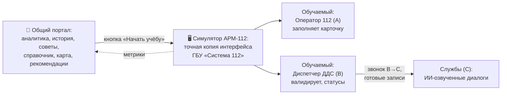

# 🗺️ Карта проекта — RespondersAcademy (hack)

> Последнее обновление: 2026-09-21
> Статус: 🟢 концепция финализирована. Оцифрованы рукописные заметки команды,
> все открытые вопросы закрыты. Кодовая база ещё не начата — в проекте
> документация, датасеты и референсы интерфейса.

## Что это?

**Учебный симулятор АРМ-112** для хакатона «Лидеры цифровой трансформации»
(задача №9, заказчик — Департамент ГОЧСиПБ г. Москвы): платформа подготовки
диспетчеров экстренных служб по вызовам 112 с использованием ИИ.

**Ты** = команда-разработчик. Обучающиеся — диспетчеры ДДС и операторы 112,
преподаватель контролирует класс, админ управляет системой.

## Как устроен продукт



## Ключевые решения (21.09.2026)

| Вопрос | Решение |
|--------|---------|
| Аудио | Диалоги заранее озвучиваются ИИ, в рантайме — проигрывание записей (TTS на CPU не тянет) |
| Роли обучаемого | Две подроли: Оператор 112 (точка A) и Диспетчер ДДС (точка B); «только B→C» — про телефонию |
| Карта без интернета | Локальный справочник адресов: Москва + Московская область |
| Оценка ошибок | «Эффект домино»: каскадные ошибки считаются одной ошибкой с корневой причиной |
| Адаптация | Рекомендательная система меняет сложность по скорости и безошибочности |

Подробности: 👉 **[Фичи/00-ОБЩАЯ-КОНЦЕПЦИЯ](Фичи/00-ОБЩАЯ-КОНЦЕПЦИЯ.md)**,
матрица ролей — **[Фичи/02-РОЛИ-И-СЦЕНАРИИ](Фичи/02-РОЛИ-И-СЦЕНАРИИ.md)**.

## 📁 Структура проекта

```
hack/
├─ README.md              ← ты здесь
├─ .ai/                   ← контекст для ИИ-агентов (карта, стек, уроки, состояние сессий)
├─ .foryou/               ← документы для команды
│  ├─ PROJECT_MAP.md      ← эта карта
│  ├─ CHANGELOG.md        ← история изменений
│  └─ Фичи/               ← продуктовая концепция (оцифрованные заметки + решения)
├─ Фронт/                 ← нормативная документация по АРМ-112
│  ├─ ФРОНТ-АРМ-112-ЕДИНЫЙ-ДОКУМЕНТ.md
│  ├─ МОКИ-ДАННЫЕ.md      ← схемы JSON + 96 учебных билетов
│  ├─ ПРАВИЛА-КОДА-ФРОНТ.md ← FSD, обязательно к прочтению перед кодом
│  └─ Источники/          ← материалы заказчика: PDF/DOCX/XLSX, Q&A, скриншоты
└─ rot_*.jpg              ← повёрнутые фото рукописных заметок
```

## 🔗 Быстрые ссылки

- Требования заказчика: `Фронт/ФРОНТ-АРМ-112-ЕДИНЫЙ-ДОКУМЕНТ.md` (раздел 6 — Q&A)
- Данные для разработки: `Фронт/МОКИ-ДАННЫЕ.md`
- Референсы интерфейса: `Фронт/Источники/скриншоты_из_docx/`
- История решений по заметкам: `.foryou/Фичи/03-ОТКРЫТЫЕ-ВОПРОСЫ.md`
