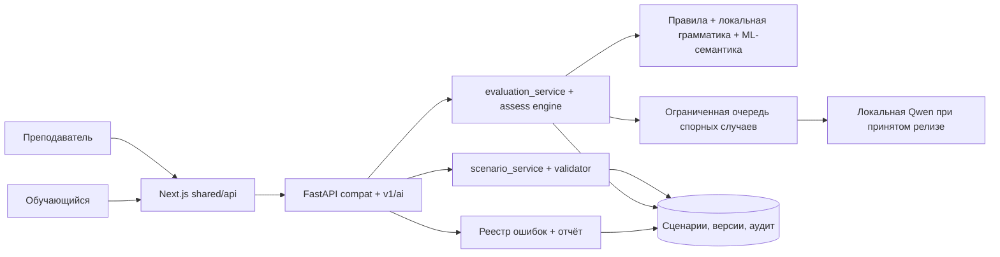

# Архитектура и маршруты фичи 001

Фича дополняет существующий backend. Next.js остаётся пользовательским интерфейсом и использует `src/shared/api`; прямых запросов компонентов к LLM нет. Старый `/api/mock/*` сохраняет форму ответа, новый `/api/v1/ai/*` несёт состояние review и полный реестр. Подробные операции — [contracts/ai-workflow-v1.md](contracts/ai-workflow-v1.md).

## Границы и отказы

1. Генерация и подготовка датасета проходят через один реестр `SanitizedTicket`: `piiCheck=passed`, `reviewerId`, `sourceHash`. Исходный скан остаётся в карантине. Генерация берёт утверждённый билет и локальные справочники; LLM может предложить фабулу. Валидатор и преподаватель решают публикацию. При отказе LLM допустим шаблонный черновик.
2. Сдача попытки сохраняет событие и ID до медленной оценки. Основной оценщик формирует проверяемые компоненты и ошибки; только спорный смысл попадает в ограниченную очередь LLM. Таймаут переводит этот компонент на ручную проверку.
3. Переход A→B берёт сохранённую студентом карточку `operator112` через сервис попыток, фиксирует `sourceAttemptId`, `sourceCardId`, `sourceCardVersion` и создаёт вход `dds`; преподавательский эталонный снимок не служит источником полей ДДС.
4. Реестр ошибок строится из сохранённых записей с ruleId/доказательством, отчёт агрегирует их. `TeacherOverride`, `CalibrationSample` и аудит фиксируются атомарно. Поздний результат LLM не переписывает финальное решение преподавателя.
5. B→C остаётся утверждённым скриптом; орфография остаётся в `backend/ml/nlp/grammar.py`. Обучающий режим `operator112` работает с подготовленным аудио заявителя; эта фича не вводит свободный голосовой диалог.

## Пользовательские экраны и API

- `src/pages/teacher-scenarios` и `teacher-scenario-editor` — запрос вариации, версия, проверка, правка и утверждение.
- `src/pages/teacher-monitor` и `teacher-report-session` — поступление оценки, полный review и реестр ошибок.
- `src/pages/progress` и карточка обучающегося — своя предварительная/окончательная оценка и статус ожидания.
- `backend/app/api/compat/scenarios.py`, `attempts.py`, `grammar.py` — совместимый путь.
- `backend/app/api/v1/` — новые draft/review/errors endpoints; всё под RBAC.

Артефакты модели ставятся в `backend/models/` при установке; runtime не обращается в интернет. Версии, размер на диске и CPU-профиль документируются перед активацией по [правилам выпуска](release-gates.md).
