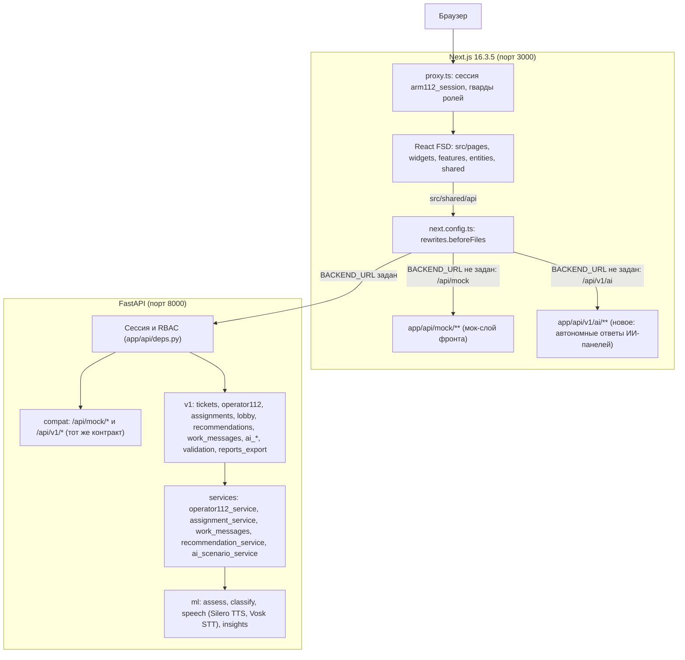
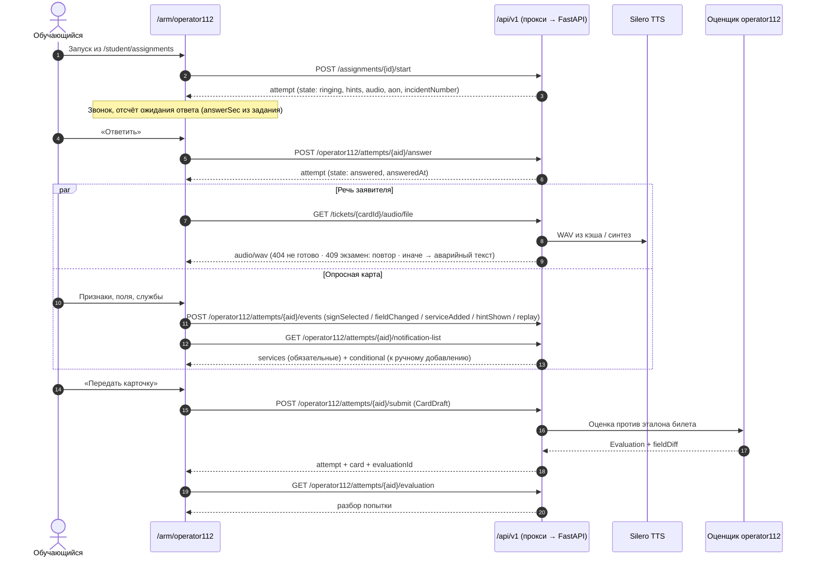
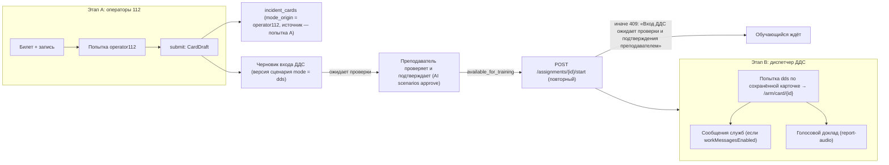

# Архитектура и сетевая топология: Сквозная интеграция (Фича 002)

Документ описывает сетевые режимы, маршруты новых экранов, жизненные циклы вызова и цепочки A → B, а также границы слоёв фронта. Формы данных не дублируются: они определены в коде бэкенда и в [`contracts/v1-integration.md`](contracts/v1-integration.md). Прежние TypeScript-интерфейсы черновика (`Operator112Attempt`, `CardDraft` и др.) удалены — они не совпадали с кодом бэкенда.

---

## 1. Сетевая топология и режимы работы

Два режима запуска (AGENTS §3):

1. **С реальным бэкендом.** Заданы `BACKEND_URL` (например, `http://localhost:8000`) и пересобран фронт. `next.config.ts` (`rewrites.beforeFiles`) направляет `/api/mock/*` и `/api/v1/*` на FastAPI; cookie `arm112_session` остаётся same-origin. В бэкенде оба префикса входят в `API_PREFIXES` (по умолчанию `/api/mock` и `/api/v1`): под `/api/v1` смонтированы и compat-эндпоинты, и новые v1.
2. **Автономный (мок-слой).** `BACKEND_URL` не задан. `/api/mock/*` обслуживают Route Handlers `app/api/mock/**`. Для `/api/v1/ai/*` добавляются обработчики `app/api/v1/ai/**` на синтетических данных (FR-002). Остальные пути `/api/v1/*` в автономном режиме не обслуживаются; экраны, которые к ним обращаются, обязаны показать состояние «требуется сервер» (FR-003, допущение A3).

Правило перенаправления запекается в `.next/routes-manifest.json` при `next build`: после смены `BACKEND_URL` нужна пересборка.

---

## 2. Слои фронта и слайсы

Правила — `spec/000-фронт/10-code-rules.md` и AGENTS §7: импорты только вниз, публичный API слайса — `index.ts` без `export *`, стили — CSS-модули на токенах, вызовы сети — только из `src/shared/api`, состояния loading / empty / error / success обязательны, Steiger — гейт сборки. Часть B добавляет **два контура** (`07-platform-shell.md` §2): платформа (новые токены `--pf-*`, новая оболочка) и симулятор (`/arm/*`, прежние токены АРМ).

| Слой | Новые/изменяемые слайсы | Содержание |
|---|---|---|
| `shared/api` | `endpoints/{operator112,assignments,lobby,kb,work-messages,auth}.ts`, типы в `types/`; `client.ts` (`ServerRequiredError`, обработка 401) | Клиенты и типы v1; авторизация — новый `auth.ts` (вход, выход, `session`, смена пароля, выход везде) |
| `shared/config` | `routes.ts`, `env.ts` | Маршруты платформы и симулятора; **серверные** переменные (секрет подписи мок-cookie) — только в серверных модулях, не в слайсах |
| `shared/lib` | `audio-recorder`, `realtime` (готов), `clock`, `network`, `storage` | Cookie-хранилище перестаёт использоваться для сессии (остаётся для несекретных предпочтений) |
| `shared/ui` | `styles/tokens-platform.css` (`--pf-*`), `platform/` (`PlatformShell`, `PageHeader`, `Card`, `StatTile`, `DataTable`, `EmptyState`, `Skeleton`, `Stepper`, `Field`, `Alert`); существующие `panel`, `chip`, `charts`, `ai-badge`, … | Набор компонентов платформы; симулятор их не использует |
| `entities` | `user` (профиль из `GET /auth/session`, `verifySession`, без cookie-JSON), `operator112-attempt`, `assignment`, `recommendation`, `kb-article`, `work-message` | Модели и селекторы без UI |
| `features` | `auth-form` (вход платформы), `password-change`, `operator112-questionnaire`, `operator112-address`, `report-recorder`, `assignment-create` (мастер назначения), `assignment-start` | Интерактивные действия |
| `widgets` | `platform-nav` (боковая и верхняя панели), `operator112-softphone`, `work-message-feed`, `simulator-bar` («В кабинет»), `kpi-summary`, `attempt-review` | Составные блоки; `app-nav` заменяется `platform-nav` для платформы и `simulator-bar` для симулятора |
| `pages` | Платформа: `login`, `student-home`, `student-assignments`, `student-results`, `student-analytics`, `reference`, `account`, `teacher-assignments`, `teacher-students`, `teacher-groups`, `admin-home`, `admin-audit`, `admin-security`; существующие `teacher-*`, `admin-*` переоформляются. Симулятор: `journal`, `incident`, `phone`, `operator112` | Экраны |
| `app/` (FSD) | `layouts/PlatformLayout`, `layouts/SimulatorLayout` (обёртывают существующие `ArmJournalLayout`, `ArmCardLayout`, `LightArmLayout`), `proxy/authProxy` (оптимистично), `session` (без клиентского cookie) | Лэйауты, сессия, гварды |
| корневой `app/` | Тонкие обёртки: `app/student/**`, `app/reference/**`, `app/account/**`, `app/teacher/**`, `app/admin/**`, `app/arm/**` (симулятор: `operator112`, существующие) | Только реэкспорт слайсов |

Идентификаторы слайсов — рабочие; окончательные имена фиксирует реализация под контролем Steiger. Импорт между слайсами одного слоя запрещён: переходы между страницами — через `ROUTES`.

## 3. Маршруты

Полная карта платформы и симулятора — `07-platform-shell.md` §3.1. Ключевое для интеграции:

| Маршрут | Экран | Примечание |
|---|---|---|
| `/student/assignments` | Задания и экзамены (платформа) | Запуск: `POST /assignments/{id}/start` → переход в симулятор |
| `/arm/operator112?assignmentId=…` | Рабочее место 112 (**симулятор**) | Попытку по id получить нельзя: бэкенд не имеет `GET /operator112/attempts/{id}`. Выдача и восстановление открытой попытки (в том числе после перезагрузки) — через `POST /assignments/{id}/start`: он возвращает уже открытую попытку для тренировки и экзамена (`assignment_service.py:259-264`). Прямой `POST /operator112/attempts` для восстановления не годится: в экзамене он даёт 409 при любой существующей попытке по билету (`operator112_service.py:178-179`) |
| `/student/analytics`, `/student/results[/id]` | Аналитика и результаты (платформа) | Заменяют `/arm/progress`; старый адрес — редирект |
| `/reference[/id]` | Справочник (платформа, все роли) | Заменяет `/arm/help`; старый адрес — редирект |
| `/arm/card/[cardId]`, `/arm`, `/arm/phone` | Симулятор (существующие) | Добавляется лента сообщений служб и запись доклада; сверху — панель «В кабинет» |

Гварды `proxy.ts`: matcher расширяется на `/student/:path*`, `/reference/:path*`, `/account/:path*` (доступ — любая аутентифицированная роль для `reference` и `account`); чужая роль → `/forbidden`, без сессии → `/login?returnUrl=…`. Параметр `assignmentId` без прав → 403 сервера → «Доступ запрещён»; неизвестный → «Задание не найдено».

### 3.1. Граница «платформа ↔ симулятор»

- Платформа рендерится в `PlatformLayout` (светлая тема платформы, боковая и верхняя панели). Симулятор — в существующих лэйаутах АРМ (тёмный журнал, светлая карточка) плюс тонкая панель `simulator-bar` в токенах АРМ: «← В кабинет», название задания и лимит.
- Переход платформа → симулятор — только по действию пользователя (кнопки «Начать», «Продолжить», «Открыть АРМ»); симулятор → платформа — «В кабинет»; открытая попытка живёт на сервере и не зависит от навигации.
- Тесты на границу: экраны `/arm/*` не импортируют `shared/ui/platform` и токены `--pf-*` (правило lint/Steiger либо тест импортов), платформенные страницы не используют токены АРМ, кроме статусных.

### 3.2. Авторизация в архитектуре

Целевая модель — `07-platform-shell.md` §6: cookie `arm112_session` выдаёт сервер (`HttpOnly`), `proxy.ts` проверяет оптимистично (срок и роль из полезной нагрузки JWT без проверки подписи), серверные лэйауты вызывают `verifySession()` — серверный `fetch` на собственный origin `/api/mock/auth/session` с пробросом cookie (rewrite ведёт на бэкенд при `BACKEND_URL`, иначе отвечает мок; `BACKEND_URL` не читается, AGENTS §6), кэш на рендер — единственный источник роли и профиля. Клиентский `session-store` и JSON-cookie удаляются; клиентские компоненты получают профиль через `SessionProvider` от серверного лэйаута; ответ 401 любого запроса ведёт на `/login?returnUrl=…&reason=expired`.

## 4. Жизненный цикл вызова в режиме «Специалист-112»

Состояния попытки на бэкенде: `ringing` → `answered` → `submitted` (`AttemptState`, `backend/app/schemas/v1/operator112.py`). Норматив ожидания ответа — `params.norms.answerSec` задания.

---

## 5. Цепочка A → B (задание `chain`)

Механика проверена по `backend/app/services/assignment_service.py:255-335` и `specs/002-two-mode-simulator/STATUS.md` (фаза 15). Карточка этапа A **не попадает в журнал ДДС автоматически**: после передачи создаётся черновик входа ДДС, который подтверждает преподаватель, и только затем этап B выдаётся повторным `start`.

Проверки бэкенда, которые фронт обязан отобразить как понятные сообщения (409): «Сначала сохраните карточку режима 112», «Вход ДДС ожидает проверки и подтверждения преподавателем», «Сохранённая карточка изменилась после подтверждения ДДС», «Цепочка A → B уже завершена», «Цепочке A → B не назначена утверждённая версия operator112». Ответ старта для этапа ДДС — не `OperatorAttempt`, а `{ sessionId, attempt, created }` (форма compat-попытки), поэтому клиент различает два вида ответа `POST /assignments/{id}/start`.

---

## 6. Сообщения служб и голосовой доклад (этап ДДС)

- **Планирование.** Сообщения создаются при принятии карточки (статус `accepted`), только если в плане занятия/параметрах задания `workMessagesEnabled: true`. Четыре сообщения: `departed`, `arrived`, `started`, `done` (ожидаемые статусы `responseStarted`, `arrived`, `workInProgress`, `workDone`) с интервалами от принятия: 20/50/90/150 с по умолчанию, настраиваются `workMessageIntervalsSec` и `workMessageIntervalsByGroup` (`backend/app/services/work_messages.py`). Оценщик проверяет, что статус выставлен до сообщения и с задержкой не более 30 с.
- **Доставка.** `GET /attempts/{id}/work-messages?since=<ISO>` возвращает наступившие сообщения; клиент опрашивает с курсором `since` и не дублирует уже показанные. Периодичность опроса — решение плана (не реже интервала между сообщениями, с остановкой на скрытой вкладке).
- **Голосовой доклад.** Клиент отправляет `multipart/form-data` (`file` — WAV моно 16 бит 8 или 16 кГц, не больше 20 МБ; `to_number`, по умолчанию `112`). Распознавание — локальная модель Vosk small-ru; без модели — 503 и пояснение. Чек-лист — пять пунктов (номер карточки, адрес, тип, пострадавшие, решение). Запись сохраняется в `backend/var/recordings/` и доступна по возвращённой ссылке.

---

## 7. Производительность и отказоустойчивость

- Аудио запрашивается один раз на попытку (в экзамене второй запрос — 409); плеер не предзагружает записи будущих билетов.
- Опрос ленты сообщений и таймеры останавливаются при уходе со страницы и на скрытой вкладке.
- Временные зависимости: если Silero TTS или Vosk не установлены, деградация штатная (`emergency`/503), а не ошибка страницы.
- Внешних адресов нет: шрифты, иконки, модели — локальные (конституция I, AGENTS §2).
